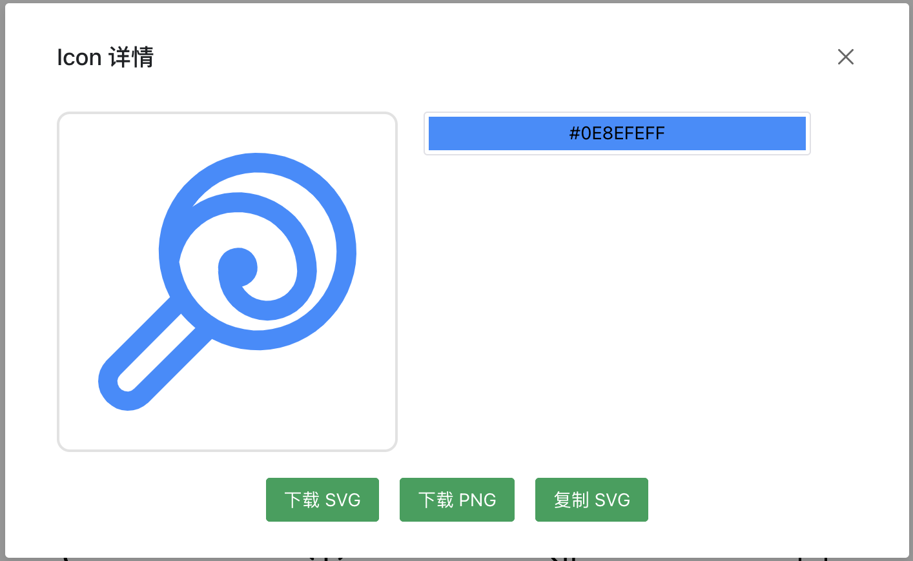

# Reader Font

字体文件读取工具，用于读取字体文件中的内容并进行展示，可用于字体图标的单个字体的导出、下载等操作。

在线演示地址：[https://alexpang.cn/reader-font/](https://alexpang.cn/reader-font/)

## 使用方法

### 安装

```bash
npm install
```

### 启动

```bash
npm run dev
```

## 截图



